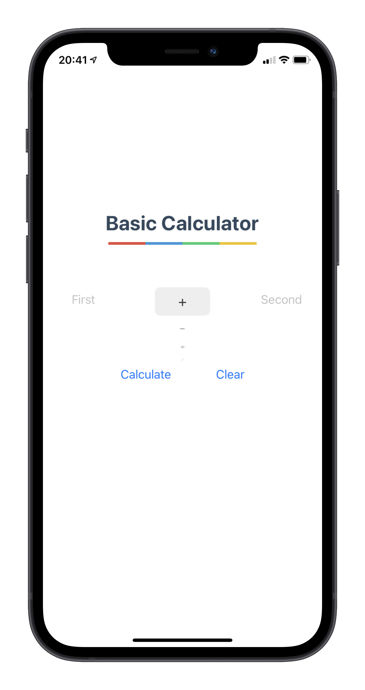
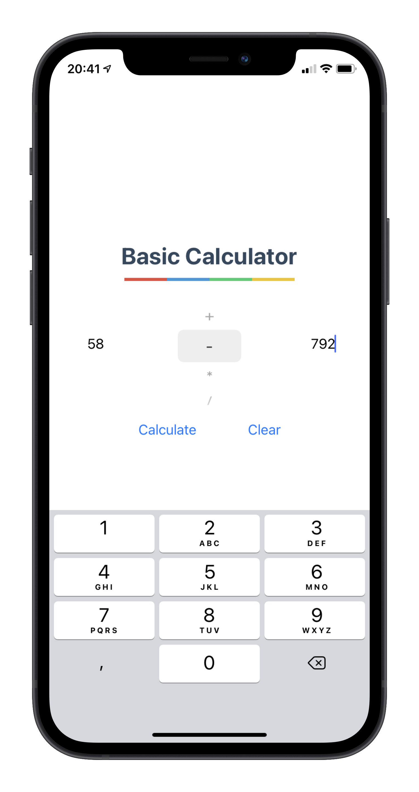
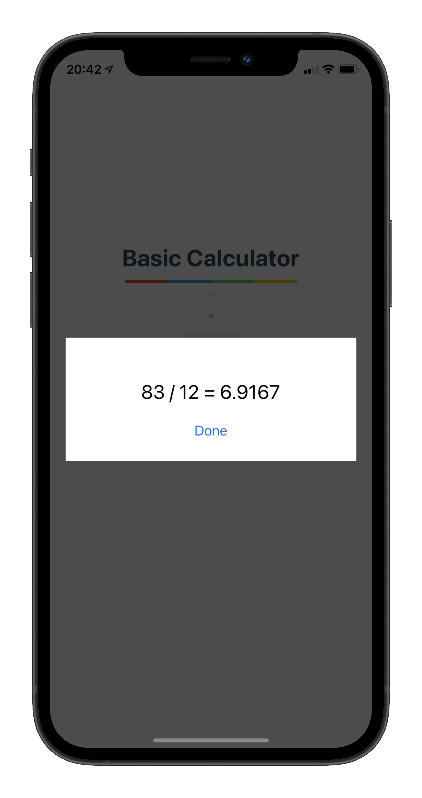

<p align="center">
  
</p>
<hr />

<div style="margin: 30px 0 40px 0;">
An iPhone (and Android) application developed in React Native using TypeScript.

The app itself is rather simple, as the name suggests. It is just a small calculator app that supports addition, subtraction, multiplication and division, both with integers and with decimal numbers. The app rounds decimal numbers to 4 digits, and the maximum input length is 8 digits.

> The app is **not** available on App Store or Google Play, just locally on own device via Xcode

</div>

<hr style="margin: 50px 0 50px 0;"/>

## 📱 - Mockup images

<p align="center">
  
</p>

<p align="center">
  
</p>

<p align="center">
  
</p>

<p align="center">
  
</p>

<hr style="margin: 50px 0 50px 0;"/>

## 💻 - How to run

After cloning the project, first run the following command:

```sh
# Install all dependencies
npm install
```

Then choose one of the following options:

### **Approach 1** - on iOS Simulator

```sh
# Run the application in iOS Simulator
# (requires Xcode)
npm start
```

### **Approach 2** - with Expo

```sh
# Alternatively without Xcode
# (requies Expo CLI)
expo convert

# Run the application in Metro
npm start

```

### **Approach 3** - on Device (requires Xcode)

1. Make sure to have Xcode installed
2. Register for an Apple Developer Account (use this when signing in to Xcode)
3. Connect your device to your computer
4. Open `ios/BasicCalculator.xcworkspace` in Xcode
5. Make sure your device is selected as "simulator"
6. Press Build and Run, then wait for app to install

For more detailed instructions, see [Apple's website](https://help.apple.com/xcode/mac/current/#/dev60b6fbbc7)

<hr style="margin: 50px 0 50px 0;"/>

## 🔨 - Technologies

- React Native
- TypeScript
- Expo (for preview during development)
- Node (for packages)
- Xcode (for tweaking production settings)
- Figma (for design)

## 👨‍🔧 - Developer info

Created by Julian Grande 👨‍💻
